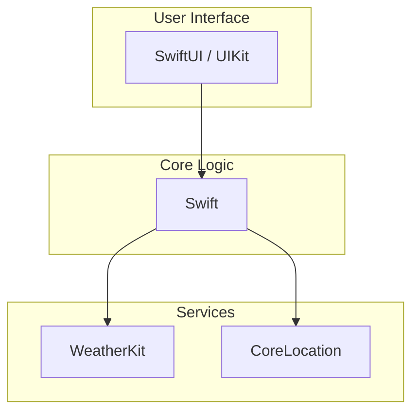

# Dual Weather

## Overview
Dual Weather is a simple iOS application built using Swift and WeatherKit. It provides real-time weather updates for your current location, displaying essential weather data in both imperial and metric measurements.

## Demo

You can see screen recordings and screenshots of the app [here](https://brandonlc2020.github.io/Portfolio/project/4).

## Features
- Displays temperature in Fahrenheit and Celsius
- Shows wind speed in mph and km/h
- Provides current weather conditions
- Includes humidity and UV index information
- Automatically fetches weather data based on your location

## Technologies Used
- Swift
- WeatherKit
- CoreLocation (for location services)
- SwiftUI/UIKit (depending on your UI implementation)

## Installation
1. Clone the repository:
2. Open the project in Xcode:
3. Ensure you have the necessary permissions for location services in your `Info.plist`.
4. Build and run the app on a physical device or simulator.

## Usage
1. Launch the app.
2. Grant location permissions when prompted.
3. View real-time weather details for your current location.
4. Toggle between metric and imperial units if implemented.

## License
This project is licensed under the MIT License.
